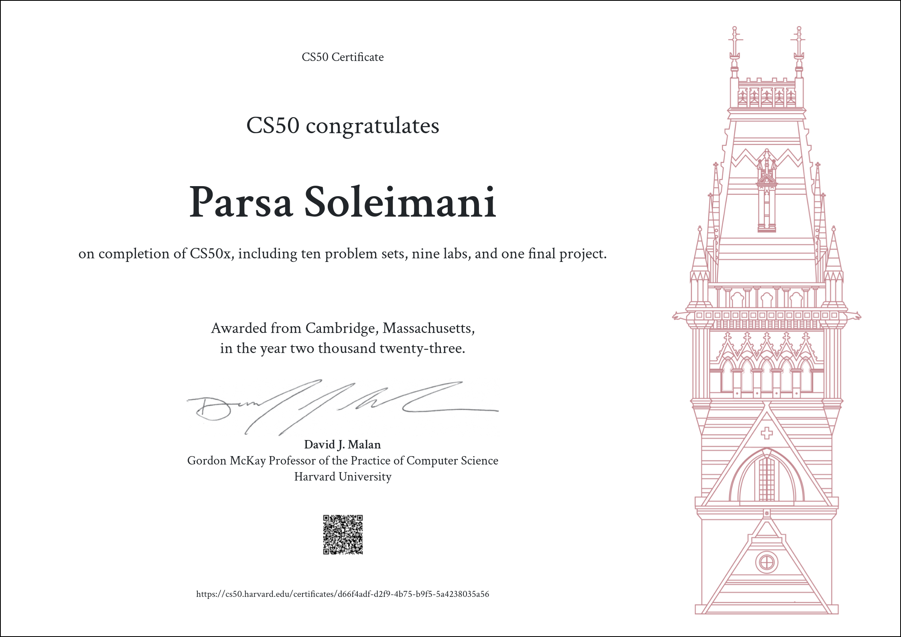

# My CS50X Projects
 
## About CS50X
CS50X is harvard universities' introduction to programming course
in this course the materials hover over numerous practical topics ranging in programming languages from c to python to java script and many other and in the techinical field providing material on algorithms and data structures and so much more
## final project
the final project of mine on this cource is [XO_ai](https://github.com/parsoli83/XO_ai) which I highly recommend visiting.
This was CS50!